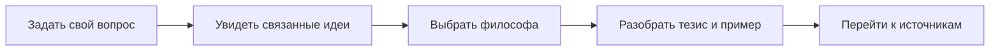

<div align="center">


# Философская карта

**100 философов · 700 идей · один маршрут через историю мысли**

Интерактивный атлас, который помогает начать не с терминов, а с собственного вопроса.

[Открыть карту](https://philosophy-atlas.ru) · [Посмотреть редакционный аудит](EDITORIAL_AUDIT.md)


</div>

## Что это

«Философская карта» — русскоязычный образовательный атлас мировой философии. Он связывает эпохи, школы и мыслителей с вопросами, которые остаются личными и сегодня: свобода, тревога, смысл, власть, справедливость, любовь, смерть и знание.

Вместо линейного учебника пользователь получает несколько входов: хронологическую карту, поиск по собственному вопросу и подробные профили философов.



## Возможности

- хронологическая карта из 100 философов разных традиций;
- 700 ключевых идей с современными примерами;
- тематические маршруты по жизненным и общественным вопросам;
- профили с биографией, идеями, цитатами и временной шкалой;
- честная маркировка прямых цитат, поздних свидетельств и редакционных формулировок;
- академические и первичные источники для дальнейшего чтения;
- sitemap, robots, canonical URL, JSON-LD и отдельный `llms.txt`.

## Редакционная честность

Проект не выдаёт красивую формулировку за доказанный факт. Приоритет отдан первичным текстам, критическим изданиям, Stanford Encyclopedia of Philosophy, академическим издательствам и университетским ресурсам.

Проверка 100 профилей продолжается. Открытые вопросы, исправления и границы достоверности публично зафиксированы в [EDITORIAL_AUDIT.md](EDITORIAL_AUDIT.md).

## Локальный запуск

Требования:

- Node.js `>=22.13.0`;
- Linux либо совместимое окружение с `bash`, `flock`, `curl` и GNU `timeout`.

```bash
npm install
npm run dev
```

## Проверки

```bash
npm run lint
npm test
```

Сборка и проверка артефакта:

```bash
npm run build
npm run validate:artifact
```

## Архитектура

```text
app/         страницы, метаданные, sitemap, robots и llms.txt
components/  карта канона и профили философов
lib/         канон, профили, идеи, примеры и атрибуции
public/      портреты и редакционные изображения
db/          опциональная схема Cloudflare D1
scripts/     сборка, экспорт и проверки целостности
tests/       проверки сгенерированного HTML и метаданных
```

## Технологии

Next.js, React, TypeScript, Vinext, Vite, Cloudflare Workers и опциональные Cloudflare D1 + Drizzle.

## Статус

Работающий публичный проект с продолжающимся редакционным аудитом. Сообщить об ошибке или предложить источник можно через [Issues](https://github.com/kosbushe/philosophy-atlas/issues).

---

Создатель — **Константин Буше**. Редакционный участник — **Илья Зибарев**.
